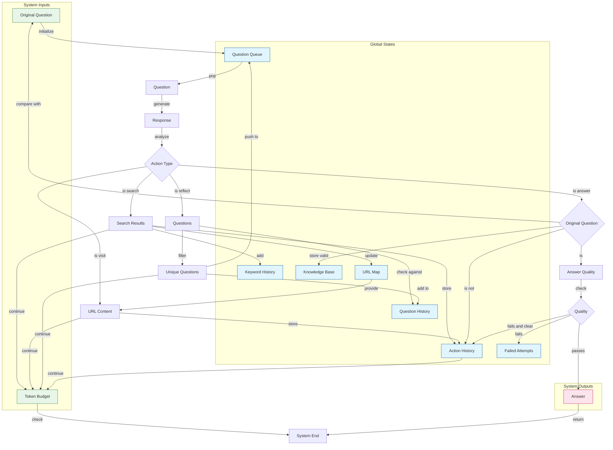

```bash
export GOOGLE_API_KEY=...  # ask han
export JINA_API_KEY=jina_...  # get from jina.ai
npm install
# example: no tool calling 
npm run dev "1+1="
npm run dev "what is the capital of France?"

# example: simple
npm run dev "what is the latest news from Jina AI?"

# example: wrong answer
npm run dev "what is the twitter account of jina ai's founder"

# example: open question, long chain of thoughts
npm run dev "who will be president of US in 2028?"
npm run dev "what should be jina ai strategy for 2025?"
```

## Web Server API

Start the server:
```bash
npm run serve
```

The server will start on http://localhost:3000 with the following endpoints:

### POST /api/v1/query
Submit a query to be answered:
```bash
curl -X POST http://localhost:3000/api/v1/query \
  -H "Content-Type: application/json" \
  -d '{
    "q": "what is the capital of France?",
    "budget": 1000000,
    "maxBadAttempt": 3
  }'
```

Response:
```json
{
  "requestId": "1234567890"
}
```

### GET /api/v1/stream/:requestId
Connect to the Server-Sent Events stream to receive progress updates and the final answer:
```bash
curl -N http://localhost:3000/api/v1/stream/1234567890
```

The server will emit the following event types:
- Progress updates: Step number and budget usage
- Final answer with complete response data
- Error messages if something goes wrong

Example events:
```
data: {"type":"progress","data":"Step 1 / Budget used 10%"}
data: {"type":"progress","data":"Step 2 / Budget used 25%"}
data: {"type":"answer","data":{"action":"answer","answer":"Paris is the capital of France","references":[]}}
```

```


