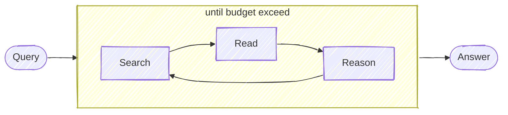

# DeepResearch

Keep searching, reading webpages, reasoning until an answer is found (or the token budget is exceeded). Useful for deeply investigating a query.



Note that this project doesn't try to mimic what OpenAI or Gemini do with their deep research product. The idea in this project is about using this loop cycle to repeat the search until finding the answer. This project doesn't implement the structural article generation part. So if you want a service that can do deep searches and give you an answer, this is it. If you want a service that mimics long article writing like OpenAI/Gemini, **this isn't it.**

## Install

```bash
git clone https://github.com/jina-ai/node-DeepResearch.git
cd node-DeepResearch
npm install
```

[安装部署视频教程 on Youtube](https://youtu.be/vrpraFiPUyA)

It is also available on npm but not recommended for now, as the code is still under active development.


## Usage

We use Gemini (latest `gemini-2.0-flash`) / OpenAI / [LocalLLM](#use-local-llm) for reasoning, [Jina Reader](https://jina.ai/reader) for searching and reading webpages, you can get a free API key with 1M tokens from jina.ai. 

```bash
export GEMINI_API_KEY=...  # for gemini
# export OPENAI_API_KEY=... # for openai
# export LLM_PROVIDER=openai # for openai
export JINA_API_KEY=jina_...  # free jina api key, get from https://jina.ai/reader

npm run dev $QUERY
```

## Demo
> was recorded with `gemini-1.5-flash`, the latest `gemini-2.0-flash` leads to much better results!

Query: `"what is the latest blog post's title from jina ai?"`
3 steps; answer is correct!


Query: `"what is the context length of readerlm-v2?"`
2 steps; answer is correct!


Query: `"list all employees from jina ai that u can find, as many as possible"` 
11 steps; partially correct! but im not in the list :(


Query: `"who will be the biggest competitor of Jina AI"` 
42 steps; future prediction kind, so it's arguably correct! atm Im not seeing `weaviate` as a competitor, but im open for the future "i told you so" moment.


More examples:

```
# example: no tool calling 
npm run dev "1+1="
npm run dev "what is the capital of France?"

# example: 2-step
npm run dev "what is the latest news from Jina AI?"

# example: 3-step
npm run dev "what is the twitter account of jina ai's founder"

# example: 13-step, ambiguious question (no def of "big")
npm run dev "who is bigger? cohere, jina ai, voyage?"

# example: open question, research-like, long chain of thoughts
npm run dev "who will be president of US in 2028?"
npm run dev "what should be jina ai strategy for 2025?"
```

## Use Local LLM

> Note, not every LLM works with our reasoning flow, we need those who support structured output (sometimes called JSON Schema output, object output) well. Feel free to purpose a PR to add more open-source LLMs to the working list.

If you use Ollama or LMStudio, you can redirect the reasoning request to your local LLM by setting the following environment variables:

```bash
export LLM_PROVIDER=openai  # yes, that's right - for local llm we still use openai client
export OPENAI_BASE_URL=http://127.0.0.1:1234/v1  # your local llm endpoint
export OPENAI_API_KEY=whatever  # random string would do, as we don't use it (unless your local LLM has authentication)
export DEFAULT_MODEL_NAME=qwen2.5-7b  # your local llm model name
```


## Server API

### OpenAI-Compatible Chat Completions

Start the server:
```bash
# Without authentication
npm run serve

# With authentication (clients must provide this secret as Bearer token)
npm run serve --secret=your_secret_token
```

The server will start on http://localhost:3000 with the following endpoint:

#### POST /v1/chat/completions
```bash
# Without authentication
curl http://localhost:3000/v1/chat/completions \
  -H "Content-Type: application/json" \
  -d '{
    "model": "gpt-4o-mini",
    "messages": [
      {
        "role": "user",
        "content": "Hello!"
      }
    ]
  }'

# With authentication (when server is started with --secret)
curl http://localhost:3000/v1/chat/completions \
  -H "Content-Type: application/json" \
  -H "Authorization: Bearer your_secret_token" \
  -d '{
    "model": "gpt-4o-mini",
    "messages": [
      {
        "role": "user",
        "content": "Hello!"
      }
    ],
    "stream": true
  }'
```

Response format:
```json
{
  "id": "chatcmpl-123",
  "object": "chat.completion",
  "created": 1677652288,
  "model": "gpt-4o-mini",
  "system_fingerprint": "fp_44709d6fcb",
  "choices": [{
    "index": 0,
    "message": {
      "role": "assistant",
      "content": "YOUR FINAL ANSWER"
    },
    "logprobs": null,
    "finish_reason": "stop"
  }],
  "usage": {
    "prompt_tokens": 9,
    "completion_tokens": 12,
    "total_tokens": 21,
    "completion_tokens_details": {
      "reasoning_tokens": 0,
      "accepted_prediction_tokens": 0,
      "rejected_prediction_tokens": 0
    }
  }
}
```

For streaming responses (stream: true), the server sends chunks in this format:
```json
{
  "id": "chatcmpl-123",
  "object": "chat.completion.chunk",
  "created": 1694268190,
  "model": "gpt-4o-mini",
  "system_fingerprint": "fp_44709d6fcb",
  "choices": [{
    "index": 0,
    "delta": {
      "content": "..."
    },
    "logprobs": null,
    "finish_reason": null
  }]
}
```

Note: The think content in streaming responses is wrapped in XML tags:
```
<think>
[thinking steps...]
</think>
[final answer]
```

## Server Setup

### Local Setup
Start the server:
```bash
# Without authentication
npm run serve

# With authentication (clients must provide this secret as Bearer token)
npm run serve --secret=your_secret_token
```

### Docker Setup

#### Build Docker Image
To build the Docker image for the application, run the following command:
```bash
docker build -t deepresearch:latest .
```

#### Run Docker Container
To run the Docker container, use the following command:
```bash
docker run -p 3000:3000 --env GEMINI_API_KEY=your_gemini_api_key --env JINA_API_KEY=your_jina_api_key deepresearch:latest
```

#### Docker Compose
You can also use Docker Compose to manage multi-container applications. To start the application with Docker Compose, run:
```bash
docker-compose up
```

## How Does it Work?

Not sure a flowchart helps, but here it is:


## Evaluation

I kept the evaluation simple, LLM-as-a-judge and collect some [ego questions](./src/evals/ego-questions.json) for evaluation. These are the questions about Jina AI that I know 100% the answer but LLMs do not.

I mainly look at 3 things: total steps, total tokens, and the correctness of the final answer.

```bash
npm run eval ./src/evals/ego-questions.json
```

Here's the table comparing plain `gemini-2.0-flash` and `gemini-2.0-flash + node-deepresearch` on the ego set.

Plain `gemini-2.0-flash` can be run by setting `tokenBudget` to zero, skipping the while-loop and directly answering the question. 

It should not be surprised that plain `gemini-2.0-flash` has a 0% pass rate, as I intentionally filtered out the questions that LLMs can answer.

| Metric | gemini-2.0-flash | gemini-2.0-flash + node-deepresearch （#5e80ed4） |
|--------|------------------|-------------------------------------------------|
| Pass Rate | 0% | 60%                                             |
| Average Steps | 1 | 5                                               |
| Maximum Steps | 1 | 13                                              |
| Minimum Steps | 1 | 2                                               |
| Median Steps | 1 | 3                                               |
| Average Tokens | 428 | 59,408                                          |
| Median Tokens | 434 | 16,001                                          |
| Maximum Tokens | 463 | 347,222                                         |
| Minimum Tokens | 374 | 5,594                                           |
