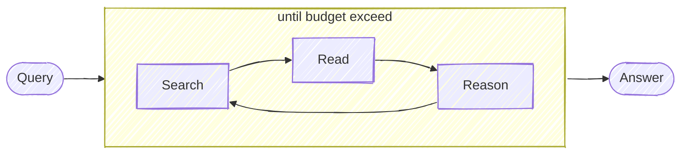

# DeepResearch

Keep searching, reading webpages, reasoning until it finds the answer (or exceeding the token budget).



## Install

```bash
git clone https://github.com/jina-ai/node-DeepResearch.git
cd node-DeepResearch
npm install
```

[安装部署视频教程 on Youtube](https://youtu.be/vrpraFiPUyA)

## Usage

We use Gemini (latest `gemini-2.0-flash`) / OpenAI / [LocalLLM](#use-local-llm) for reasoning, [Jina Reader](https://jina.ai/reader) for searching and reading webpages, you can get a free API key with 1M tokens from jina.ai. 

```bash
export GEMINI_API_KEY=...  # for gemini
# export OPENAI_API_KEY=... # for openai
# export LLM_PROVIDER=openai # for openai
export JINA_API_KEY=jina_...  # free jina api key, get from https://jina.ai/reader

npm run dev $QUERY
```

## Demo
> was recorded with `gemini-1.5-flash`, the latest `gemini-2.0-flash` leads to much better results!

Query: `"what is the latest blog post's title from jina ai?"`
3 steps; answer is correct!


Query: `"what is the context length of readerlm-v2?"`
2 steps; answer is correct!


Query: `"list all employees from jina ai that u can find, as many as possible"` 
11 steps; partially correct! but im not in the list :(


Query: `"who will be the biggest competitor of Jina AI"` 
42 steps; future prediction kind, so it's arguably correct! atm Im not seeing `weaviate` as a competitor, but im open for the future "i told you so" moment.


More examples:

```
# example: no tool calling 
npm run dev "1+1="
npm run dev "what is the capital of France?"

# example: 2-step
npm run dev "what is the latest news from Jina AI?"

# example: 3-step
npm run dev "what is the twitter account of jina ai's founder"

# example: 13-step, ambiguious question (no def of "big")
npm run dev "who is bigger? cohere, jina ai, voyage?"

# example: open question, research-like, long chain of thoughts
npm run dev "who will be president of US in 2028?"
npm run dev "what should be jina ai strategy for 2025?"
```

## Use Local LLM

> Note, not every LLM works with our reasoning flow, we need those who support structured output (sometimes called JSON Schema output, object output) well. Feel free to purpose a PR to add more open-source LLMs to the working list.

If you use Ollama or LMStudio, you can redirect the reasoning request to your local LLM by setting the following environment variables:

```bash
export LLM_PROVIDER=openai  # yes, that's right - for local llm we still use openai client
export OPENAI_BASE_URL=http://127.0.0.1:1234/v1  # your local llm endpoint
export DEFAULT_MODEL_NAME=qwen2.5-7b  # your local llm model name
```


## Web Server API

Start the server:
```bash
npm run serve
```

The server will start on http://localhost:3000 with the following endpoints:

### POST /api/v1/query
Submit a query to be answered:
```bash
curl -X POST http://localhost:3000/api/v1/query \
  -H "Content-Type: application/json" \
  -d '{
    "q": "what is the capital of France?",
    "budget": 1000000,
    "maxBadAttempt": 3
  }'
```

Response:
```json
{
  "requestId": "1234567890"
}
```

### GET /api/v1/stream/:requestId
Connect to the Server-Sent Events stream to receive progress updates and the final answer:
```bash
curl -N http://localhost:3000/api/v1/stream/1234567890
```

The server will emit the following event types:
- Progress updates: Step number and budget usage
- Final answer with complete response data
- Error messages if something goes wrong

Example events:
```
data: {"type":"progress","trackers":{"tokenUsage":74950,"tokenBreakdown":{"agent":64631,"read":10319},"actionState":{"action":"search","think":"The provided text mentions several investors in Jina AI but doesn't specify ownership percentages.  A direct search for ownership percentages is needed to answer the question definitively.","URLTargets":[],"answer":"","questionsToAnswer":[],"references":[],"searchQuery":"Jina AI investor ownership percentages"},"step":7,"badAttempts":0,"gaps":[]}}

data: {"type":"progress","trackers":{"tokenUsage":74950,"tokenBreakdown":{"agent":64631,"read":10319},"actionState":{"action":"search","think":"The provided text mentions several investors in Jina AI's funding rounds but doesn't specify ownership percentages.  A search focusing on equity stakes and ownership percentages held by each investor will provide the necessary information to answer the main question.","URLTargets":[],"answer":"","questionsToAnswer":[],"references":[],"searchQuery":"Jina AI investor equity percentage ownership stake"},"step":8,"badAttempts":0,"gaps":[]}}

data: {"type":"progress","trackers":{"tokenUsage":88096,"tokenBreakdown":{"agent":77777,"read":10319},"actionState":{"action":"search","think":"The provided text mentions several investors in Jina AI's funding rounds but doesn't specify ownership percentages.  A search focusing on equity stakes and ownership percentages held by each investor will provide the necessary information to answer the main question.","URLTargets":[],"answer":"","questionsToAnswer":[],"references":[],"searchQuery":"Jina AI investor equity percentage ownership stake"},"step":8,"badAttempts":0,"gaps":[]}}
```

## Docker

### Build Docker Image
To build the Docker image for the application, run the following command:
```bash
docker build -t deepresearch:latest .
```

### Run Docker Container
To run the Docker container, use the following command:
```bash
docker run -p 3000:3000 --env GEMINI_API_KEY=your_gemini_api_key --env JINA_API_KEY=your_jina_api_key deepresearch:latest
```

### Docker Compose
You can also use Docker Compose to manage multi-container applications. To start the application with Docker Compose, run:
```bash
docker-compose up
```

## How Does it Work?

Not sure a flowchart helps, but here it is:


## Evaluation

I kept the evaluation simple, LLM-as-a-judge and collect some ego questions (i.e. questions about Jina AI that I know 100% the answer) for evaluation.

I mainly look at 3 things: total steps, total tokens, and the correctness of the final answer.

```bash
npm run eval ./src/evals/ego-questions.json
```